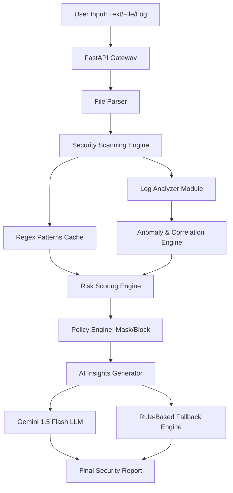

# AI Secure Data Intelligence Platform
### (AI Gateway + Scanner + Log Analyzer + Risk Engine)

## 📌 Project Overview
The **AI Secure Data Intelligence Platform** is a state-of-the-art security tool designed for the SISA Software Intern Hackathon. It acts as a multi-layered defense and intelligence gateway that analyzes text, files (PDF/DOC), SQL, Chat, and Log data for sensitive information, security vulnerabilities, and anomalies.

## 🚀 Key Features
- **Multi-Source Ingestion**: Unified analysis for Plain Text, SQL, Chat, and Log files.
- **Deep File Parsing**: Native support for extracting data from `.pdf`, `.docx`, `.doc`, `.txt`, and `.log`.
- **Intelligent Log Analyzer**: Line-by-line parsing to detect stack traces, debug leaks, and brute-force patterns.
- **Dual-Layer Insights**:
    - **AI-Powered**: Uses Google Gemini 1.5 Flash for advanced security recommendations.
    - **Rule-Based Fallback**: A local expert system that provides instantaneous security insights even without an API key.
- **Dynamic Risk Engine**: Real-time risk scoring (0-100) with visual gauge feedback.
- **Policy Enforcement**: Automated masking of sensitive data (PII, Passwords, API Keys) based on risk severity.
- **Premium UI**: Dark-mode glassmorphism dashboard featuring a **Sticky Navigation Bar**, **Interactive 3D Tilt** cards, and a dynamic **Cyber-Pulse** background.
- **On-Demand AI Hub**: Decoupled LLM intelligence that remains optional and activates only upon user consultation for advanced insights and remediation playbooks.

## 🏗️ System Architecture
The platform follows a modular pipeline architecture to ensure high performance and scalability:



## 📂 Project Structure
```text
SISA_ASSIGNMENT/
├── backend/
│   ├── __init__.py         # Python Package Marker
│   ├── main.py             # Server, Static File Routing & Orchestration
│   ├── detection.py        # Core Security Scanner (Regex Engine)
│   ├── log_analyzer.py     # Log Parsing, Anomaly Detection & Correlation
│   ├── risk_engine.py      # Weighted Risk Scoring Logic
│   ├── policy_engine.py    # Automated Masking & Blocking Rules
│   ├── ai_insights.py      # AI LLM Integration & Rule-Based Fallback
│   ├── file_parser.py      # PDF, DOCX, & Log Content Extraction
│   └── requirements.txt    # Backend Dependencies
├── frontend/
│   ├── index.html          # Main Dashboard & UI Structure
│   ├── style.css           # Premium Glassmorphism Styling
│   └── app.js              # Frontend Controller & API Integration
├── Procfile                # Railway Deployment Configuration
├── README.md               # Technical Documentation
└── SUBMISSION_SUMMARY.md   # Project Experience / Explanation
```

## 📸 Visual Demo & Screenshots

### 1. Unified Premium Dashboard
A professional dark-mode interface with a real-time risk gauge, sticky glassmorphism navbar, and Cyber-Pulse animation.


### 2. AI Security Remediation Playbook
Step-by-step incident response plans generated by LLM for high-risk findings.


## 🚀 Deployment to Vercel
The platform is optimized for **Vercel** (Free Tier).

1.  **Connect GitHub**: Go to [Vercel.com](https://vercel.com), create a new project, and connect this GitHub repository.
2.  **Environment Variables**: In the Vercel project settings, go to **Environment Variables** and add `GEMINI_API_KEY`.
3.  **Automatic Build**: Vercel will detect the `vercel.json` and deploy the FastAPI backend as a serverless function.
4.  **Access**: Your app will be live at `https://your-app.vercel.app/app`.

### 3. Log Viewer & Highlighting
Automated identification and marking of sensitive lines within large log files.


## 🛠️ Technology Stack
- **Backend**: Python 3.10+, FastAPI (Asynchronous API), Uvicorn.
- **Frontend**: Vanilla JavaScript (ES6+), HTML5, CSS3 (Custom Glassmorphism Design System).
- **Core Libraries**: `google-generativeai`, `PyPDF2`, `python-docx`, `python-dotenv`.

## 📦 Installation & Execution
Follow these steps to run the platform locally:

### Step 1: Install Dependencies
Open your terminal in the `backend/` directory and run:
```bash
pip install -r requirements.txt
```

### Step 2: Configure AI (Optional)
If you have a Gemini API key, add it to `backend/.env`:
```env
GEMINI_API_KEY=your_key_here
```

### Step 3: Start the Backend Server
Run the following command to start the FastAPI server:
```bash
python -m uvicorn main:app --host 0.0.0.0 --port 8000
```

### Step 4: Access the Application
Open your browser and navigate to:
**https://sisa-intelligence-secure-data-analy-sable.vercel.app/app**

## 🛡️ Security & Observability
The platform is designed with security in mind, implementing CORS protection and a robust error-handling middleware to ensure stable operations during high-load security scans.
